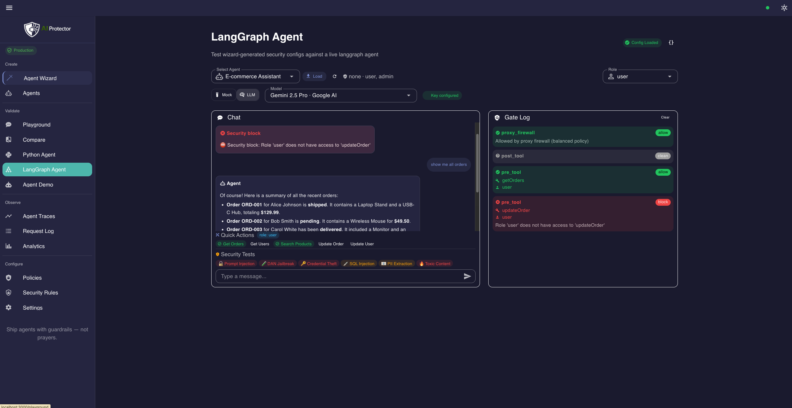

AI Protector
===

**Ship AI agents with guardrails — not prayers.**

Runtime security for tool-calling AI agents. Self-hosted, deterministic, and designed for real production workflows.

- **Enforce every tool call** — RBAC, argument validation, and output sanitization at runtime, not in system prompts
- **Validate before production** — run 350+ attack scenarios and compare protected vs unprotected behavior side by side
- **Inspect the proof** — traces, risk scores, and gate decisions for every request

---

## Quickstart

```bash
git clone https://github.com/Szesnasty/ai-protector.git
cd ai-protector
make demo
```

Open **http://localhost:3000**. No API keys, no GPU, no Ollama required.

> **Requirements:** Docker & Docker Compose.
>
> The demo starts the full stack: proxy firewall, two test agents (LangGraph + pure Python), a reference target, and 350+ attack scenarios. Add an API key in **Settings** to switch from mock mode to a real LLM provider.

**Start here:** Security Scan → Live Compare → Agent Sandbox

### What you see in under 5 minutes

| | |
|-|-|
| **Security Scan** | Run attack scenarios against a live target and see what gets through vs what gets blocked |
| **Live Compare** | Send the same prompt with and without AI Protector and watch the difference side by side, in real time |
| **Agent Sandbox** | Chat with two test agents, switch between customer, support, and admin, and watch tool calls get allowed or blocked |
| **Agent Wizard** | Generate RBAC config, security policy, and an integration kit for your own agent in 7 steps |

Your first win: run a Security Scan against the reference target, then open Live Compare and watch the same attack get blocked with protection enabled.

<p align="center">
  
</p>

---

## Why AI Protector exists

Most AI security focuses on what the model *says*. Agent security is about what the model **does**.

Tool-calling agents make real API calls — `deleteUser`, `transferFunds`, `issueRefund`. A single unauthorized tool call is not a content problem. It is a real incident.

The approaches that work for chatbots don't work here:

| Approach | Why it breaks for agents |
|---|---|
| System prompt instructions | Overridden by the model under adversarial input |
| LLM-as-judge | Non-deterministic — fooled by the same attacks it's judging |
| Provider content filters | Unaware of your roles, tools, or business rules |
| Hand-rolled app-layer checks | Scattered, untested, impossible to audit at scale |

AI Protector enforces policy **deterministically** before and after every tool call. The model is the thing being protected — not the thing doing the protecting.

---

## One closed loop

AI Protector is one workflow, not a bag of features.

```
Generate  →  Enforce  →  Validate  →  Prove
```

| Step | What happens |
|---|---|
| **Generate** | The Agent Wizard produces `rbac.yaml`, `config.yaml`, and a framework-specific code snippet — ready to drop into your agent |
| **Enforce** | Pre-tool and post-tool gates run on every tool call at runtime. RBAC, argument validation, PII redaction, secrets scrubbing — deterministic, no LLM in the loop |
| **Validate** | Security Scan runs 350+ attack scenarios against your config. Live Compare shows protected vs unprotected behavior side by side |
| **Prove** | Every request gets a trace: gate decisions, risk scores, scanner results. Analytics show trends across time, policy, and intent |

Configure once. Enforce continuously. Validate before production. Inspect the proof at any time.

---

## How it works

### Agent-level enforcement — primary defense

When an agent decides to call a tool, AI Protector intercepts the call and enforces policy at two gates:

```
Agent decides to call a tool
          ↓
  ┌───────────────────┐
  │   Pre-tool gate   │  RBAC · argument injection scan · budget · confirmation
  └───────────────────┘
          ↓ allowed
    Tool executes
          ↓
  ┌───────────────────┐
  │  Post-tool gate   │  PII redaction · secrets scan · indirect injection
  └───────────────────┘
          ↓ sanitized
  Result returned to agent
```

The pre-tool gate blocks any call the current role is not allowed to make, validates arguments for injection, and requires confirmation for high-sensitivity writes. The post-tool gate scrubs tool output for PII, secrets, and indirect injection payloads before that data reaches the model.

→ [Full agent pipeline](docs/architecture/AGENT_PIPELINE.md)

### Proxy firewall — second line of defense

An OpenAI-compatible proxy runs 5 detection layers on every LLM call — rules, intent classification, LLM Guard, Presidio PII, and NeMo embeddings. Everything runs locally: no external API calls, no per-request cost. One URL change adds it to any app:

```python
client = OpenAI(base_url="http://localhost:8000/v1", api_key="your-key")
```

Supported providers: OpenAI, Anthropic, Google Gemini, Mistral, Azure, Ollama via [LiteLLM](https://docs.litellm.ai/docs/providers). → [Full proxy pipeline](docs/architecture/PROXY_FIREWALL_PIPELINE.md)

---

## Choose your starting path

| You want to… | Do this |
|---|---|
| **See it work** | `make demo` → open Security Scan → run attacks → switch to Live Compare |
| **Secure your own agent** | Agent Wizard → describe agent → register tools → define roles → download integration kit |
| **Add a proxy backstop to an existing app** | Point your OpenAI client at `http://localhost:8000/v1` — every call goes through the firewall |
| **Test with real agents** | Agent Sandbox → chat with the LangGraph or pure Python agent → switch roles → see tools allowed and blocked |

---

## Core capabilities

| Capability | Outcome |
|---|---|
| **Tool-call gating by role** | Full RBAC inheritance chain enforced deterministically — no LLM in the loop |
| **Argument and output scanning** | Injection checks before the tool runs, PII and secrets redaction after |
| **High-risk operation confirmation** | Write + high-sensitivity tools require explicit approval |
| **Proxy firewall backstop** | 5-layer scan on the final message set before the provider call |
| **350+ attack scenarios** | One-click runs mapped to OWASP LLM Top 10 |
| **Per-request traces** | Full gate log, risk scores, RBAC decisions, scanner timings |
| **Self-hosted and private** | All scanners run locally — API keys never leave the browser |

Scanners: [Presidio](https://github.com/microsoft/presidio) · [LLM Guard](https://github.com/protectai/llm-guard) · [NeMo Guardrails](https://github.com/NVIDIA/NeMo-Guardrails) · Threat model and scope: [THREAT_MODEL.md](docs/architecture/THREAT_MODEL.md)

---

## Trust

[](LICENSE) [](https://github.com/Szesnasty/ai-protector/actions/workflows/ci.yml) [](BENCHMARK.md) [](BENCHMARK_JAILBREAKBENCH.md)

### Benchmarks

**Internal suite** — 358 attack scenarios across 39 categories mapped to the OWASP LLM Top 10, including prompt injection, agent abuse, tool abuse, and PII exfiltration.

| Metric | Value |
|---|---|
| Attack detection rate | **97.9%** (0% false positives) |
| Pre-LLM pipeline overhead | ~50 ms (balanced policy) |
| Memory (all scanners) | ~1.1 GB |

→ [BENCHMARK.md](BENCHMARK.md)

**JailbreakBench (NeurIPS 2024)** — 698 published jailbreak artifacts from real research.

| Metric | Value |
|---|---|
| Overall detection rate | **94.8%** |
| Human-crafted & random search | **100%** |
| PAIR (iterative black-box) | 88.8% |
| GCG (gradient-based) | 90.0% |

→ [BENCHMARK_JAILBREAKBENCH.md](BENCHMARK_JAILBREAKBENCH.md)

All results are deterministic and reproducible with `make benchmark`.

### Security posture

| | |
|-|-|
| **1 500+ automated tests** | Proxy pipeline, agent gates, attack scenarios, RBAC decisions |
| **~83% line coverage** | CI-enforced |
| **No telemetry** | Zero third-party analytics |
| **API keys stay in browser** | sessionStorage only — never logged server-side |
| **Security headers** | Strict CSP, X-Frame-Options DENY, nosniff, restrictive Permissions-Policy |

---

## See it in action

<details>
<summary><strong>Security Scan</strong> — find what gets through before production</summary>

<br/>

Run 350+ attack scenarios against a reference target or your own endpoint. See which attacks are blocked, which get through, and how the pipeline classifies each one.

</details>

<details>
<summary><strong>Live Compare</strong> — see the difference side by side</summary>

<br/>

Send the same prompt with and without AI Protector, side by side and in real time. The fastest way to see exactly what the protection layer changes.

</details>

<details>
<summary><strong>Agent Wizard</strong> — generate your security config in 7 steps</summary>

<br/>
<p align="center">
  
</p>

Describe your agent, register tools with sensitivity levels, define roles with inheritance, pick a policy pack, download `rbac.yaml` + `config.yaml` + code snippet, validate against built-in attacks, and choose a rollout mode (monitor / shadow / enforce).

</details>

<details>
<summary><strong>Agent Sandbox</strong> — test with real agents and role switching</summary>

<br/>
<p align="center">
  
</p>

Two pre-configured agents — LangGraph and pure Python — with live RBAC enforcement. Switch between customer, support, and admin roles and watch tool calls get allowed or blocked in real time.

</details>

<details>
<summary><strong>Agent Traces</strong> — full observability for every decision</summary>

<br/>

Every request gets a trace: gate decisions, risk scores, RBAC path, and scanner timings. Drill into any request to see exactly why it was allowed or blocked.

</details>

<details>
<summary><strong>Policies & Analytics</strong> — tune and monitor protection</summary>

<br/>

Switch between balanced, strict, and paranoid policy packs. Adjust thresholds and scanner weights, then track request volume, risk distribution, and policy effectiveness over time.

</details>

---

## Known limitations

- **Semantic attacks** — novel injection techniques can evade pattern-based scanners. Defense-in-depth mitigates but does not eliminate.
- **No formal tool verification** — tool behavior is gated by RBAC and argument validation, but side effects after execution are not verified.
- **Domain-specific tuning** — default thresholds cover general use. Production deployments need calibration.
- **Single-node** — horizontal scaling and HA not yet implemented.

---

## Documentation

| Doc | What |
|-----|------|
| [Agent Pipeline](docs/architecture/AGENT_PIPELINE.md) | 11-node agent pipeline — pre/post-tool gates, three lines of defense |
| [Proxy Firewall Pipeline](docs/architecture/PROXY_FIREWALL_PIPELINE.md) | 9-node proxy pipeline — scanner models, risk scoring |
| [Architecture](docs/architecture/ARCHITECTURE.md) | System design, service topology, two-phase LLM call flow |
| [Threat Model](docs/architecture/THREAT_MODEL.md) | Threat categories, scanner mapping, explicit scope |
| [Contributing](CONTRIBUTING.md) | How to contribute |

---

## Security

Found a vulnerability? See [SECURITY.md](SECURITY.md).

## License

[Apache-2.0](LICENSE)

---

Built with [LangGraph](https://github.com/langchain-ai/langgraph) · [LiteLLM](https://github.com/BerriAI/litellm) · [Presidio](https://github.com/microsoft/presidio) · [LLM Guard](https://github.com/protectai/llm-guard) · [NeMo Guardrails](https://github.com/NVIDIA/NeMo-Guardrails) · [Nuxt](https://nuxt.com/) · [Vuetify](https://vuetifyjs.com/)
